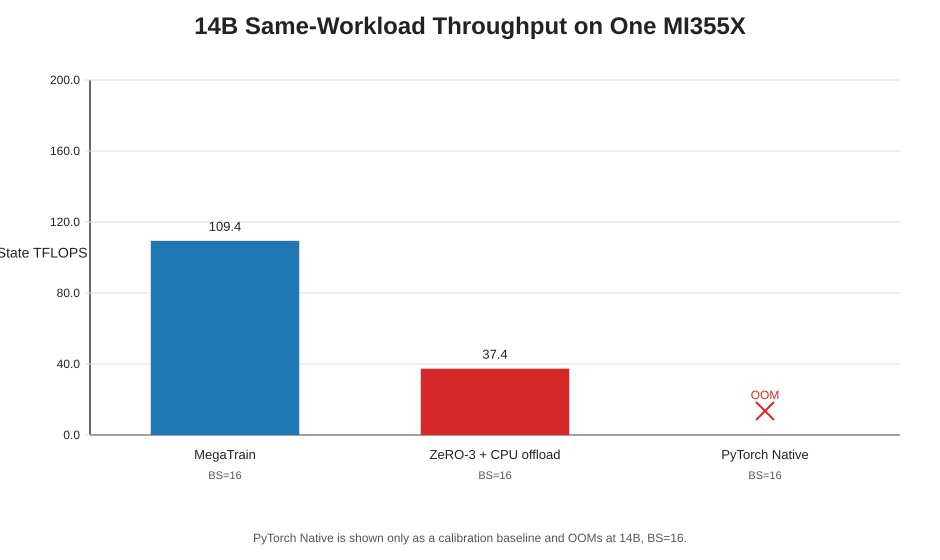
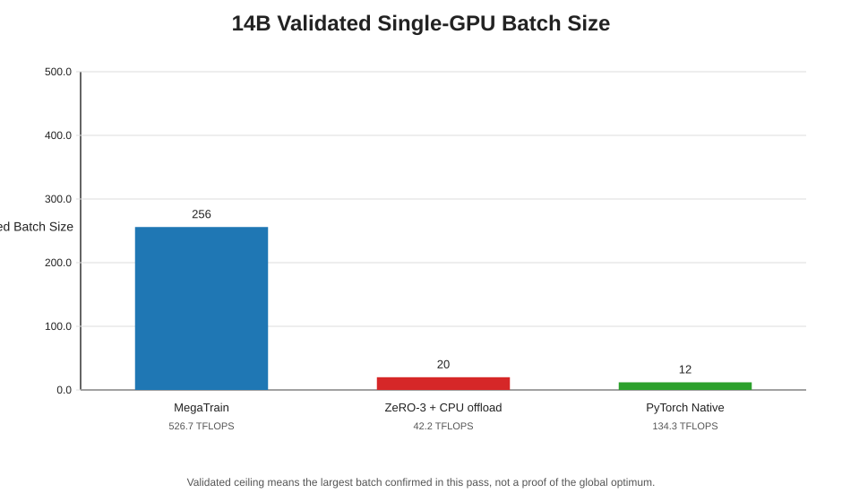
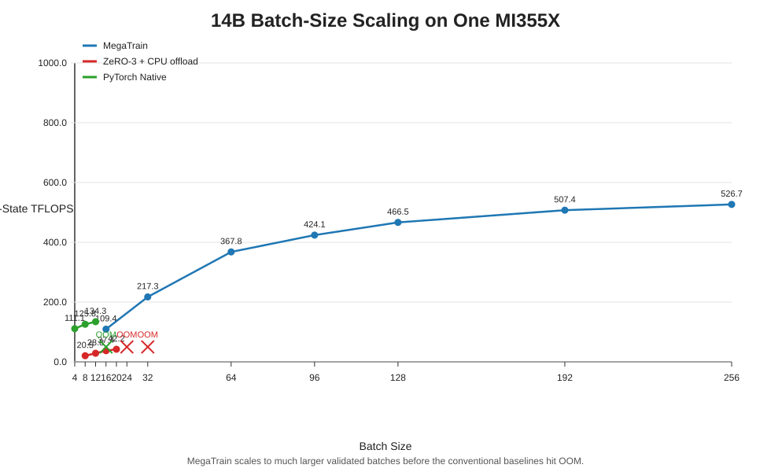
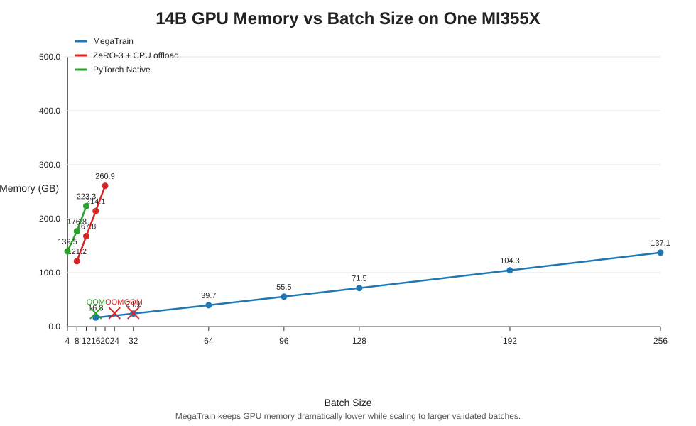
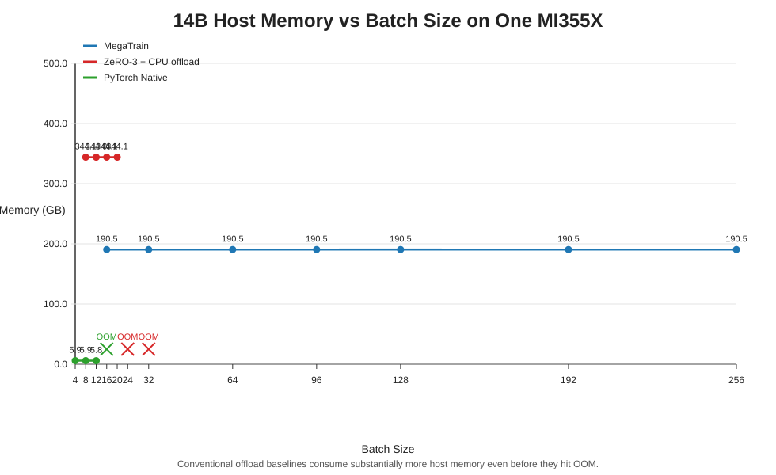
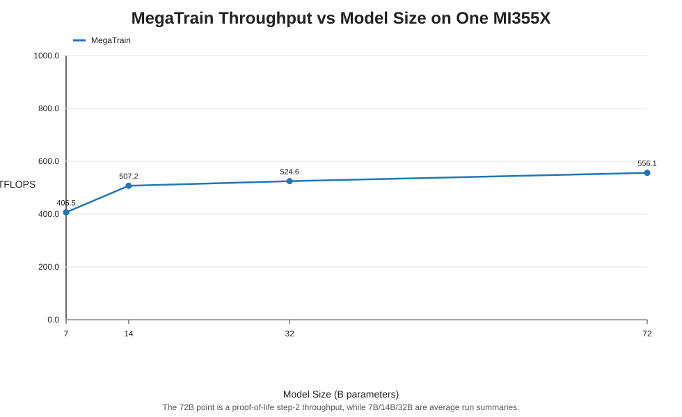
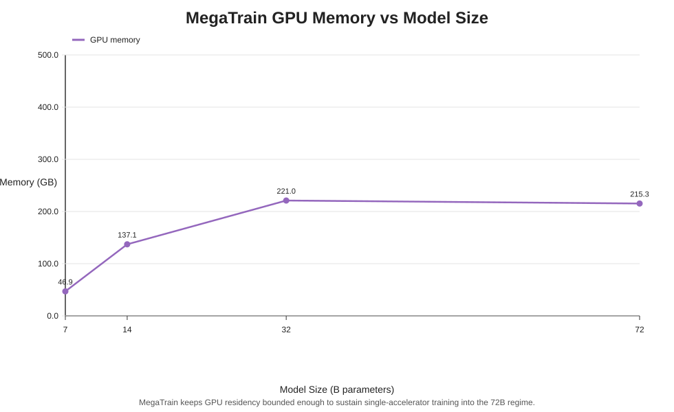
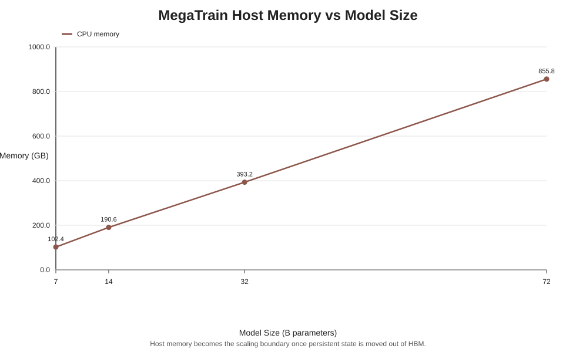

# MI355X A-First Benchmark Summary

This artifact keeps the story locked to the paper-faithful single-accelerator question: one MI355X, one node, `MetaMathQA`, `max_seq_len=1024`, and a normalized `14B` batch sweep built from `examples/configs/qwen_14b_rocm_batch_sweep.yaml`.

All new sweep charts use the same throughput definition: steady-state throughput after dropping step 1 warmup.

## Headline Findings

- At `14B, BS=16`, `MegaTrain` reaches `109.4 TFLOPS` versus `37.4 TFLOPS` for `ZeRO-3 + CPU offload`, a `2.93x` speedup on the same single-GPU workload.
- The validated `14B` batch ceilings in this pass are `BS=256` for `MegaTrain`, `BS=20` for `ZeRO-3 + CPU offload`, and `BS=12` for `PyTorch Native`.
- The AMD-specific mechanism story is now explicit: `MegaTrain` keeps gaining throughput as batch size rises, while the conventional baselines hit fit or throughput walls much earlier.

## 14B Same-Workload View

| Method | Status | Batch | Steady TFLOPS | Peak GPU (GB) | Peak CPU (GB) |
| --- | --- | --- | --- | --- | --- |
| `MegaTrain` | `success` | `16` | `109.4` | `16.8` | `190.5` |
| `ZeRO-3 + CPU offload` | `success` | `16` | `37.4` | `214.1` | `344.1` |
| `PyTorch Native` | `oom` | `16` | `OOM` | `214.3` | `5.9` |

## 14B Validated Batch Ceiling

| Method | Largest Validated Batch | Steady TFLOPS At That Batch | Peak GPU (GB) | Peak CPU (GB) |
| --- | --- | --- | --- | --- |
| `MegaTrain` | `256` | `526.7` | `137.1` | `190.5` |
| `ZeRO-3 + CPU offload` | `20` | `42.2` | `260.9` | `344.1` |
| `PyTorch Native` | `12` | `134.3` | `223.3` | `5.8` |

## 14B Batch Sweep

| Method | Batch | Status | Steady TFLOPS | Peak GPU (GB) | Peak CPU (GB) |
| --- | --- | --- | --- | --- | --- |
| `MegaTrain` | `16` | `success` | `109.4` | `16.8` | `190.5` |
| `MegaTrain` | `32` | `success` | `217.3` | `24.1` | `190.5` |
| `MegaTrain` | `64` | `success` | `367.8` | `39.7` | `190.5` |
| `MegaTrain` | `96` | `success` | `424.1` | `55.5` | `190.5` |
| `MegaTrain` | `128` | `success` | `466.5` | `71.5` | `190.5` |
| `MegaTrain` | `192` | `success` | `507.4` | `104.3` | `190.5` |
| `MegaTrain` | `256` | `success` | `526.7` | `137.1` | `190.5` |
| `ZeRO-3 + CPU offload` | `8` | `success` | `20.5` | `121.2` | `344.1` |
| `ZeRO-3 + CPU offload` | `12` | `success` | `28.8` | `167.8` | `344.0` |
| `ZeRO-3 + CPU offload` | `16` | `success` | `37.4` | `214.1` | `344.1` |
| `ZeRO-3 + CPU offload` | `20` | `success` | `42.2` | `260.9` | `344.1` |
| `ZeRO-3 + CPU offload` | `24` | `oom` | `OOM` | `OOM` | `OOM` |
| `ZeRO-3 + CPU offload` | `32` | `oom` | `OOM` | `OOM` | `OOM` |
| `PyTorch Native` | `4` | `success` | `111.1` | `139.5` | `5.9` |
| `PyTorch Native` | `8` | `success` | `125.8` | `176.8` | `5.9` |
| `PyTorch Native` | `12` | `success` | `134.3` | `223.3` | `5.8` |
| `PyTorch Native` | `16` | `oom` | `OOM` | `214.3` | `5.9` |

## MegaTrain Capability Ladder

| Model | Batch | Throughput | GPU Mem (GB) | CPU Mem (GB) | Note |
| --- | --- | --- | --- | --- | --- |
| `Qwen2.5-7B-Instruct` | `96` | `406.5` | `46.9` | `102.4` | `average` |
| `Qwen2.5-14B-Instruct` | `256` | `507.2` | `137.1` | `190.6` | `average` |
| `Qwen2.5-32B-Instruct` | `300` | `524.6` | `221.0` | `393.2` | `average` |
| `Qwen2.5-72B-Instruct` | `200` | `556.1` | `215.3` | `855.8` | `proof-of-life step 2` |

## Charts

















## Appendix: FSDP Probe

| Batch | Status | Steady TFLOPS | Peak GPU (GB) | Peak CPU (GB) |
| --- | --- | --- | --- | --- |
| `8` | `success` | `13.5` | `149.1` | `126.6` |
| `16` | `success` | `23.9` | `242.0` | `126.7` |

## Reproduction

Validated install path:

```bash
bash scripts/install_rocm.sh
```

Primary batch-scaling sweeps:

```bash
python scripts/run_batch_sweep.py --config examples/configs/qwen_14b_rocm_batch_sweep.yaml --method megatrain --batch-sizes 16 32 64 96 128 192 256 --num-steps 5 --output-dir artifacts/mi355x_paper_demo/batch_sweep --stop-after-first-failure
python scripts/run_batch_sweep.py --config examples/configs/qwen_14b_rocm_batch_sweep.yaml --method zero3_cpu_offload --batch-sizes 8 12 16 20 24 32 --num-steps 5 --output-dir artifacts/mi355x_paper_demo/batch_sweep --stop-after-first-failure
python scripts/run_batch_sweep.py --config examples/configs/qwen_14b_rocm_batch_sweep.yaml --method native --batch-sizes 4 8 12 16 --num-steps 5 --output-dir artifacts/mi355x_paper_demo/batch_sweep --stop-after-first-failure
```

Cheap FSDP probe:

```bash
python scripts/run_batch_sweep.py --config examples/configs/qwen_14b_rocm_batch_sweep.yaml --method fsdp_cpu_offload --batch-sizes 8 16 --num-steps 5 --output-dir artifacts/mi355x_paper_demo/batch_sweep --stop-after-first-failure
```

Regenerate the repo-owned artifact bundle:

```bash
python scripts/assemble_mi355x_paper_demo.py
```

## Caveats

- This is intentionally a single-accelerator benchmark. It does not claim to beat multi-GPU distributed methods in their natural regime.
- `PyTorch Native` is a calibration baseline only; it exits the comparison once the model no longer fits.
- On this ROCm stack, the ZeRO-3 benchmark uses the supported DeepSpeed-managed `AdamW` config path for CPU offload rather than a client-provided optimizer object.
- The capability ladder remains separate from the sweep charts so average showcase numbers are not conflated with steady-state sweep results.
- The `72B` throughput point is still a proof-of-life step result, not a long-run average.
